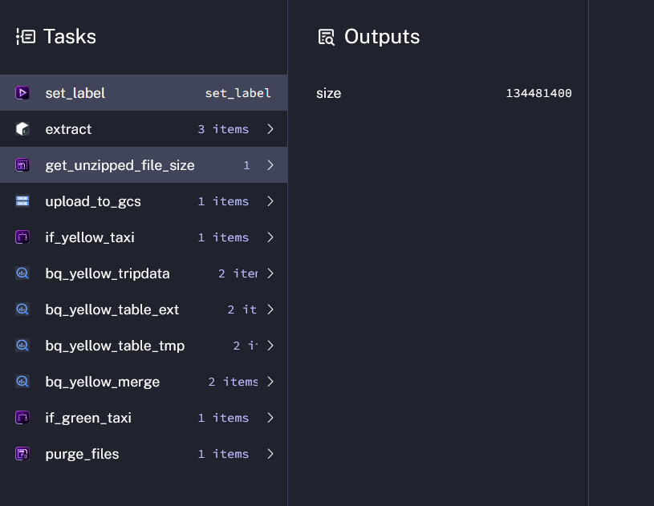

📌 Overview

This folder contains my work and homework solutions for Module 2 of the Data Engineering Zoomcamp.

In this module I worked with:

Kestra
Workflow orchestration
Google Cloud Storage (GCS)
BigQuery
ETL pipelines
Scheduled workflows
Backfills and automation

The goal of the homework was to extend the existing taxi data pipeline to process NYC Taxi data for the year 2021 using Kestra and GCP.

🚕 Module 2 Homework
Workflow Used

The workflow used for this homework is available in:

Data-Engineering-zoomcamp-Module-1-Homework-Docker-SQL/02-workflow-orchestration/flows Kestra/flow9.yml

The pipeline performs the following steps:

1. Downloads NYC taxi CSV files from GitHub
2. Uploads the files into Google Cloud Storage
3. Creates external tables in BigQuery
4. Creates temporary staging tables
5. Merges the data into partitioned production tables
5. Schedules executions for both yellow and green taxi datasets

🐳 Question 1 — File Size
Task:

Within the execution for Yellow Taxi data for the year 2020 and month 12: what is the uncompressed file size (i.e. the output file yellow_tripdata_2020-12.csv of the extract task)?

    128.3 MiB
    134.5 MiB
    364.7 MiB
    692.6 MiB

### Answer
To get the size of the unzipped file I added the following task:

  - id: get_unzipped_file_size
    type: io.kestra.plugin.core.storage.Size
    uri: "{{render(vars.data)}}"
where I got the result below

The solution is 134.5 MiB.

🐳 Question 2 — Rendered Variable Value
Task: 
What is the rendered value of the variable file when the inputs taxi is set to green, year is set to 2020, and month is set to 04 during execution?

    {{inputs.taxi}}_tripdata_{{inputs.year}}-{{inputs.month}}.csv
    green_tripdata_2020-04.csv
    green_tripdata_04_2020.csv
    green_tripdata_2020.csv

### Answer

The right answer is green_tripdata_2020-04.csv

🐳 Question 3 — Yellow Taxi Rows in 2020

Task:How many rows are there for the Yellow Taxi data for all CSV files in the year 2020?

    13,537.299
    24,648,499
    18,324,219
    29,430,127

### Answer

Query used: 

SELECT SUM(cnt) AS total_rows
FROM (
  SELECT COUNT(*) AS cnt FROM `kestra-project-496118.zoomcamp.yellow_tripdata_2020_01`
  UNION ALL
  SELECT COUNT(*) FROM `kestra-project-496118.zoomcamp.yellow_tripdata_2020_02`
  UNION ALL
  SELECT COUNT(*) FROM `kestra-project-496118.zoomcamp.yellow_tripdata_2020_03`
  UNION ALL
  SELECT COUNT(*) FROM `kestra-project-496118.zoomcamp.yellow_tripdata_2020_04`
  UNION ALL
  SELECT COUNT(*) FROM `kestra-project-496118.zoomcamp.yellow_tripdata_2020_05`
  UNION ALL
  SELECT COUNT(*) FROM `kestra-project-496118.zoomcamp.yellow_tripdata_2020_06`
  UNION ALL
  SELECT COUNT(*) FROM `kestra-project-496118.zoomcamp.yellow_tripdata_2020_07`
  UNION ALL
  SELECT COUNT(*) FROM `kestra-project-496118.zoomcamp.yellow_tripdata_2020_08`
  UNION ALL
  SELECT COUNT(*) FROM `kestra-project-496118.zoomcamp.yellow_tripdata_2020_09`
  UNION ALL
  SELECT COUNT(*) FROM `kestra-project-496118.zoomcamp.yellow_tripdata_2020_10`
  UNION ALL
  SELECT COUNT(*) FROM `kestra-project-496118.zoomcamp.yellow_tripdata_2020_11`
  UNION ALL
  SELECT COUNT(*) FROM `kestra-project-496118.zoomcamp.yellow_tripdata_2020_12`
);

The right answer is 24,648,499

🐳 Question 4 — Green Taxi Rows in 2020

Task:How many rows are there for the Green Taxi data for all CSV files in the year 2020?

    5,327,301
    936,199
    1,734,051
    1,342,034

### Answer

Query used:

SELECT SUM(cnt) AS total_rows
FROM (
  SELECT COUNT(*) AS cnt FROM `kestra-project-496118.zoomcamp.green_tripdata_2020_01`
  UNION ALL
  SELECT COUNT(*) FROM `kestra-project-496118.zoomcamp.green_tripdata_2020_02`
  UNION ALL
  SELECT COUNT(*) FROM `kestra-project-496118.zoomcamp.green_tripdata_2020_03`
  UNION ALL
  SELECT COUNT(*) FROM `kestra-project-496118.zoomcamp.green_tripdata_2020_04`
  UNION ALL
  SELECT COUNT(*) FROM `kestra-project-496118.zoomcamp.green_tripdata_2020_05`
  UNION ALL
  SELECT COUNT(*) FROM `kestra-project-496118.zoomcamp.green_tripdata_2020_06`
  UNION ALL
  SELECT COUNT(*) FROM `kestra-project-496118.zoomcamp.green_tripdata_2020_07`
  UNION ALL
  SELECT COUNT(*) FROM `kestra-project-496118.zoomcamp.green_tripdata_2020_08`
  UNION ALL
  SELECT COUNT(*) FROM `kestra-project-496118.zoomcamp.green_tripdata_2020_09`
  UNION ALL
  SELECT COUNT(*) FROM `kestra-project-496118.zoomcamp.green_tripdata_2020_10`
  UNION ALL
  SELECT COUNT(*) FROM `kestra-project-496118.zoomcamp.green_tripdata_2020_11`
  UNION ALL
  SELECT COUNT(*) FROM `kestra-project-496118.zoomcamp.green_tripdata_2020_12`
);

The right answer is 1734051

🐳 Question 5 — Yellow Taxi Rows in March 2021

Task: How many rows are there for the Yellow Taxi data for the March 2021 CSV file?

    1,428,092
    706,911
    1,925,152
    2,561,031

### Answer

Query used:

SELECT COUNT (*) 
FROM kestra-project-496118.zoomcamp.yellow_tripdata_2021_03

The right answer is 1,925,152

6. How would you configure the timezone to New York in a Schedule trigger? (1 point)
Add a timezone property set to EST in the Schedule trigger configuration
Add a timezone property set to America/New_York in the Schedule trigger configuration
Add a timezone property set to UTC-5 in the Schedule trigger configuration
Add a location property set to New_York in the Schedule trigger configuration

The righr answer is "Add a timezone property set to America/New_York in the Schedule trigger configuration"

🔐 Authentication and Environment Configuration

This project uses Google Cloud Platform services through Kestra and Docker Compose.

To authenticate Kestra with GCP, I generated a Google Cloud service account key and encoded it into environment variables used by Docker Compose.

### Environment Variable Encoding

To safely inject secrets into the Kestra container, I used the following script to generate a base64-encoded .env_encoded file:

#!/bin/bash

ENV_FILENAME=.env_encoded

while IFS='=' read -r key value; do
  echo "SECRET_$key=$(echo -n "$value" | base64)";
done < .env > $ENV_FILENAME

# Encodes the service account file without line wrapping to make sure the whole JSON value is intact.
echo "SECRET_GCP_SERVICE_ACCOUNT=$(cat service-account.json | base64 -w 0)" >> $ENV_FILENAME

I got this from kestra documentation here: https://kestra.io/docs/how-to-guides/google-credentials.

The encoded environment file is loaded into the Kestra container through Docker Compose:

kestra:
  image: kestra/kestra:v1.1
  pull_policy: always
  user: "root"
  command: server standalone

  volumes:
    - kestra_data:/app/storage
    - /var/run/docker.sock:/var/run/docker.sock
    - kestra_tmp:/tmp/kestra-wd

  env_file:
    - .env_encoded
AI Integration

The workflow also included AI-related functionality.

For that purpose, I generated a Google AI Studio API key from:

https://aistudio.google.com/app/apikey

The API key was stored in the .env file and injected into the Kestra container through Docker Compose.